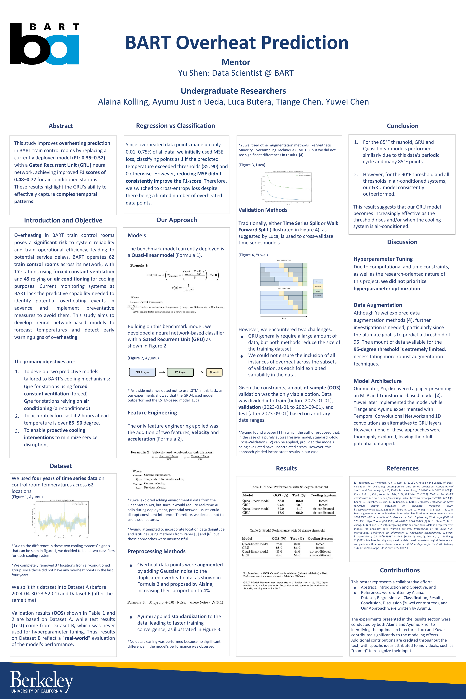

## Data
The dataset comprises time series data from train control rooms across BART stations, recorded over the last four years at 15-minute intervals.

## Task
- **Predict Overheating**: Develop a model to predict overheating events (temperatures reaching thresholds of 85°F, 90°F, and 95°F) in train control rooms 2 hours before they occur.
- **Challenge**: This involves solving an imbalanced classification problem using time series data.

## Libraries Used
- **Skorch**: modeling
- **Optuna**: hyperparameter optimization

  

